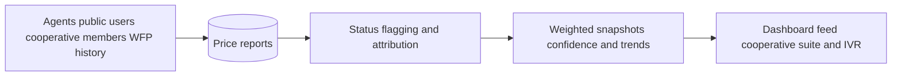
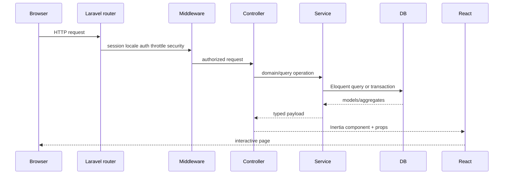
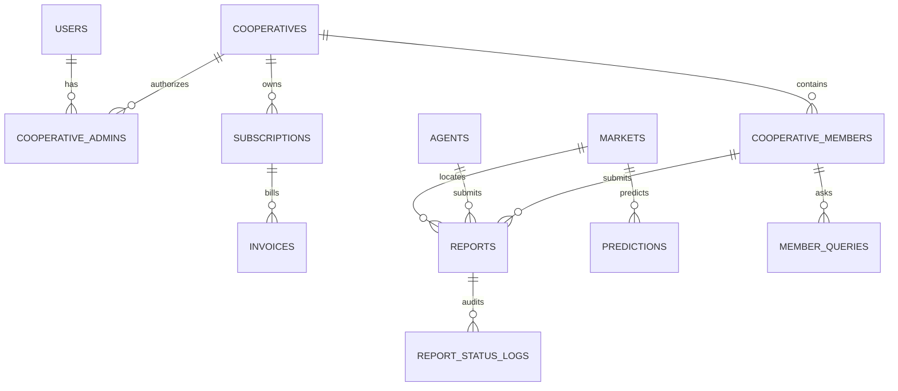

# AgriVoice — Comprehensive Product and Technical Documentation

> Source audit baseline: repository `main` at `fb69b7f` (26 July 2026).
> This is the standalone top-level reference for the application in
> [`agrivoice/`](../agrivoice/).

AgriVoice is an Ethiopian agricultural market-intelligence demonstration. It
collects attributable crop-price reports, calculates confidence-scored
crop/market snapshots, and presents them through a public dashboard, a
multilingual web experience, a field-agent PIN portal, a cooperative
administration suite, and an authenticated Amharic browser-IVR simulator.

The project is demo-complete in those bounded areas. It is not yet a production
telephony network, payment processor, trained forecasting platform, or live
SMS/WhatsApp service. This document deliberately separates implemented behavior
from seeded, simulated, optional, and roadmap behavior.

## 1. Documentation map

This file is the broad system reference. Focused documents live under the
application:

| Document | Scope |
| -------- | ----- |
| [Application documentation hub](../agrivoice/DOCS/Documentation.md) | Entry point, glossary, URLs and conventions |
| [Architecture](../agrivoice/DOCS/Architecture.md) | Request lifecycle, layers, identity and data flows |
| [Domain and database](../agrivoice/DOCS/Domain-and-Database.md) | Enums, schema, models, seeders and algorithms |
| [Features and flows](../agrivoice/DOCS/Features-and-Flows.md) | Actor-by-actor product behavior |
| [Backend reference](../agrivoice/DOCS/Backend-Reference.md) | Routes, controllers, requests, actions, services and policies |
| [Frontend reference](../agrivoice/DOCS/Frontend-Reference.md) | Pages, layouts, components, types, polling and i18n |
| [Security and authentication](../agrivoice/DOCS/Security-and-Authentication.md) | Auth boundaries, tenant isolation, headers and threats |
| [Development, testing and operations](../agrivoice/DOCS/Development-Testing-and-Operations.md) | Setup, scripts, tests and deployment |
| [IVR and WFP integration](../agrivoice/DOCS/IVR-and-WFP-Integration.md) | Addis TTS browser IVR and historical WFP import |

Repository process documents remain in this directory:

| File | Purpose |
| ---- | ------- |
| [CommitRule.md](CommitRule.md) | Git workflow and commit conventions |
| [TestingRule.md](TestingRule.md) | Team testing expectations |
| [ProgrammingRulle.md](ProgrammingRulle.md) | Programming conventions |

## 2. Product at a glance

### Core value loop



1. A field agent, public visitor, cooperative member fixture, or optional WFP
   import creates report records.
2. Verification status and `is_flagged` control whether a report may influence
   aggregates.
3. `SnapshotService` calculates current weighted price and confidence from a
   trailing 14-day window.
4. `PredictionService` compares recent seven-day and previous seven-day
   weighted means.
5. The same report base powers public tiles, a map, the report feed,
   cooperative views/exports, and Amharic IVR scripts.

### Supported domain

- Crops: teff, coffee, maize, wheat, sesame, pulses and sorghum.
- Markets: Adama, Addis Ababa and Jimma.
- Price unit: Ethiopian birr per quintal (100 kg).
- UI locales: English (`en`), Amharic (`am`) and Afaan Oromoo (`om`).
- Report statuses: pending, verified, disputed and rejected.
- Reporter types: farmer, trader, official and cooperative.

### Actors

| Actor | Identity | Main access |
| ----- | -------- | ----------- |
| Public visitor | None | Landing, dashboard, live reports, public report form |
| Field agent | `agents` row + four-digit PIN session | Agent portal and immediate verified entry |
| Fortify user | `users` row + Laravel web session | Flag reports, IVR, account/security settings |
| Cooperative admin | Fortify user + `cooperative_admins` membership | Tenant-scoped cooperative suite |

These are distinct identity systems. An agent is not a Laravel `User`.

## 3. Technology stack

| Layer | Technology |
| ----- | ---------- |
| Backend | PHP 8.3+, Laravel 13 |
| Server-rendered SPA bridge | Inertia.js 3 |
| Frontend | React 19, TypeScript |
| Styling | Tailwind CSS 4, shadcn/Radix-style UI primitives |
| Assets/build | Vite 8 |
| Typed frontend routes | Laravel Wayfinder |
| Authentication | Laravel Fortify, optional 2FA and passkeys |
| Database | SQLite by default; Eloquent-compatible relational DB |
| Maps | Leaflet / OpenStreetMap |
| Charts | Recharts |
| PDF | DomPDF |
| Tests | Pest/PHPUnit, in-memory SQLite |
| Quality | Pint, Larastan/PHPStan, TypeScript, Prettier, ESLint |
| External voice API | Addis Assistant TTS; STT/chat adapter methods exist |

The application is a Laravel monolith. Controllers return Inertia page
responses or JSON/download responses; React does not call a separately deployed
REST backend.

## 4. Repository layout

```text
agrivoice/
├── app/
│   ├── Actions/              transactional use cases
│   ├── Console/Commands/     IVR audio generation
│   ├── Enums/                domain vocabularies
│   ├── Http/
│   │   ├── Controllers/      web, portal, cooperative and IVR endpoints
│   │   ├── Middleware/       agent auth, cooperative auth, locale, headers
│   │   ├── Requests/         validation and request authorization
│   │   ├── Resources/        camelCase response contracts
│   │   └── Responses/        Fortify response overrides
│   ├── Jobs/                 invitation delivery abstraction
│   ├── Models/               Eloquent domain model
│   ├── Policies/             cooperative/report authorization
│   ├── Providers/            auth, limits, boot and URL behavior
│   └── Services/             aggregation, querying, sessions, voice
├── bootstrap/app.php         middleware aliases and global pipeline
├── config/                   app, Fortify, CORS, services, session, etc.
├── database/
│   ├── data/                 committed WFP CSV
│   ├── factories/
│   ├── migrations/
│   └── seeders/
├── lang/{en,am,om}.json      frontend/backend translations
├── public/                   icons and local landing images
├── resources/
│   ├── css/app.css           Tailwind entry, tokens, marketing styles
│   ├── js/                   Inertia pages, layouts and components
│   └── views/app.blade.php   Inertia HTML shell
├── routes/                   web, portal and settings route groups
├── tests/                    Pest feature and unit tests
└── DOCS/                     detailed technical references
```

## 5. Boot and request architecture

### Server boot

`bootstrap/app.php`:

- loads `routes/web.php` and health route `/up`;
- appends locale and security-header middleware;
- registers `agent` and `cooperative.admin` middleware aliases;
- configures exception handling.

`AppServiceProvider`:

- forces HTTPS in production;
- configures common rate limiters;
- binds model policies;
- shares/caches relevant application behavior;
- keeps local PHP/Vite loopback behavior aligned.

`FortifyServiceProvider`:

- registers user creation/password actions;
- renders Inertia authentication pages;
- customizes login responses;
- configures Fortify rate limiting and optional security features.

### Inertia lifecycle



Wayfinder generates TypeScript route/action helpers consumed by React. This
keeps frontend links and form endpoints tied to named Laravel routes.

### Layering conventions

- Controllers coordinate, but substantial querying/logic belongs in services.
- Form Requests own validation and request-level authorization.
- Actions own multi-model transactional writes.
- Policies and tenant scopes guard cooperative resources.
- Enums own stable domain vocabulary.
- HTTP Resources or explicit payload maps define frontend casing.
- Inertia props are the primary server-to-client state mechanism.

## 6. Core database model

### Main entities



### Reports: the central fact table

Important fields:

| Field | Meaning |
| ----- | ------- |
| `crop` | `Crop` enum value |
| `market_id` | Market foreign key |
| `price` | Decimal ETB/quintal |
| `reporter_type` | `ReporterType` enum |
| `source` | Informal provenance string |
| `agent_id` | Nullable field-agent attribution |
| `cooperative_member_id` | Nullable cooperative attribution |
| `reported_at` | Observation timestamp |
| `is_flagged` | Exclusion marker for suspicious reports |
| `status` | Moderation lifecycle |

Current provenance values include:

- `agent_portal` — immediate verified agent entry;
- `public_web` — anonymous pending submission;
- `wfp_food_prices` — optional historical WFP import;
- seed/reference values such as WFP or ECX labels.

### Other important entities

- `markets`: name, slug, region and map coordinates.
- `agents`: name, hashed PIN, active state.
- `users`: Fortify identity, 2FA and passkey relationships.
- `cooperatives`: organization and region.
- `cooperative_admins`: user-to-cooperative authorization.
- `cooperative_members`: status, phone, crop and location data.
- `report_status_logs`: actor, old/new status, note and timestamp.
- `subscriptions` and `invoices`: demonstration billing state.
- `predictions`: optional forecast records, not default generated ML output.
- `member_queries`: seeded voice/query activity, not live ingestion.

## 7. Price and confidence algorithms

### Eligibility

A report contributes to a public snapshot only when:

- crop and market match;
- `status = verified`;
- `is_flagged = false`;
- `reported_at` is within the trailing 14 days.

Pending public submissions, disputed/rejected reports, flagged reports and old
historical rows do not affect current tiles.

### Weighted price

Reporter weights:

| Reporter | Weight |
| -------- | -----: |
| Farmer | 1.0 |
| Trader | 1.2 |
| Official | 1.5 |
| Cooperative | 1.3 |

```text
weighted price = Σ(price × reporter weight) / Σ(reporter weight)
```

The service performs one grouped report query for all crop/market combinations,
then calculates snapshots in memory to avoid N×M query growth.

### Confidence

Confidence is a capped 0–100 score derived from:

- report volume;
- source/reporter diversity;
- recency;
- penalties for volatility/spread.

It is an explainable product heuristic, not a calibrated probability or machine
learning confidence interval.

### Trend

`PredictionService` compares weighted means:

- current window: trailing seven days;
- previous window: the seven days before that.

The result is up/down/stable with percentage change. It is deterministic
historical comparison, not a future forecast.

### Cooperative price comparison

Cooperative prices use verified/unflagged member reports from the cooperative's
region over a trailing seven-day window. Regional benchmarks use all eligible
reports in markets whose region exactly matches the cooperative region.

## 8. Feature flows

### Public landing and navigation

`GET /` renders `pages/welcome.tsx`. The current composed sequence is:

1. `hero`;
2. `services`;
3. `practical`;
4. `story`;
5. `testimonials`;
6. `cta`;
7. `footer`.

The latest landing uses local assets in `public/images/landing/`, marketing
tokens from `resources/css/app.css`, responsive navigation, appearance control,
and language switching.

Some components remain in `components/landing/` but are not mounted:
`nav`, `stats-bar`, `product-showcase`, `business-model` and `constants`.
`constants.ts` retains external Unsplash/Pexels/YouTube URLs for those unused
components. The older problem/solution/how-it-works/demo/FAQ-style sections were
deleted in the overhaul.

Marketing copy should not be read as a guarantee of every channel: actual voice
support currently means the authenticated browser IVR with TTS, not a public
telephone number.

### Public dashboard

`GET /dashboard` is anonymous and projector-friendly. It shows:

- crop/market price cards;
- report count and confidence;
- trend direction/change;
- freshness/last update;
- market markers on a Leaflet map;
- recent report context.

It polls the server every few seconds through Inertia rather than WebSockets.

### Live reports and flagging

`GET /reports` is public and returns the newest report feed. Authenticated users
may `POST /reports/{report}/flag`:

- endpoint is throttled;
- flagging is idempotent and one-way in the UI;
- flagged reports are excluded from snapshots;
- there is no unflag workflow;
- the endpoint is not cooperative-tenant-specific.

### Public report submission

`GET/POST /report-price` accepts crop, market, price and reported time. The
server, not the client, controls attribution:

- source = `public_web`;
- status = pending;
- reporter identity is the seeded `Public Submission` agent;
- the report does not influence snapshots until verified.

The public workflow itself does not provide an approval page; cooperative
moderation can operate only on tenant-relevant reports.

### Field-agent portal

`/portal/login` authenticates an active agent by name and four-digit PIN into a
custom session. `/portal` lets that agent submit reports and view recent own
submissions.

Portal reports:

- derive `agent_id` from the session;
- use source `agent_portal`;
- become verified immediately;
- can influence the live dashboard.

This is optimized for demonstration speed, not high-assurance production data
entry.

### Fortify account and security settings

Standard users have login, registration, forgot/reset password, email
verification page, profile updates, password changes, appearance, two-factor
authentication and passkey-related surfaces where enabled.

### Cooperative administration

Cooperative routes require:

```text
auth + verified + cooperative.admin
```

Features:

- KPI/trend dashboard;
- member roster, filtering, invitation, bulk invitation, detail and removal;
- report filtering, moderation and immutable status audit entries;
- CSV report export;
- current/member/regional price comparison;
- PDF weekly-price download;
- plan/invoice/payment-display screens.

Tenant isolation is implemented through middleware, policies and cooperative
query scopes. New code must not trust a client-submitted cooperative id.

Billing is simulated: no Telebirr/Chapa/bank charge API, webhook processing,
dunning, proration or tax engine exists. Payment screens store display type and
last four digits only.

## 9. Amharic browser IVR and Addis AI

### What exists

Authenticated Fortify users open `GET /ivr`. The browser displays keys:

| Key | Action |
| --- | ------ |
| 1 | Announce teff snapshots |
| 2 | Announce coffee snapshots |
| 3 | Announce maize snapshots |
| 4 | Announce wheat snapshots |
| 5 | Replay welcome/menu clips |

`IvrController@index` obtains the same current snapshots used by the dashboard.
`IvrScriptBuilder` maps crop/market names to Amharic and converts rounded prices
and confidence values through `AmharicNumberSpeech`. If a market has no usable
data, the script says data is being collected.

The React page:

- supports buttons and physical keys 1–5;
- queues and plays fixed startup clips;
- posts a crop script to `/ivr/speak`;
- plays returned MP3 URL/base64 audio;
- cancels prior playback when a new key is selected.

### Audio generation and cache

Environment:

```dotenv
ADDIS_AI_API_KEY=
ADDIS_AI_VOICE_ID=am-hamen
```

Dynamic TTS is cached at:

```text
storage/app/public/ivr/cache/{sha256(voice|text)}.mp3
```

Fixed clips are stored under `storage/app/public/ivr/{clip}.mp3`. Generate them:

```bash
php artisan storage:link
php artisan ivr:generate-audio --yes
```

The command estimates cost, optionally confirms, skips existing files unless
`--force`, and uses deterministic request ids.

### Honest boundary

- This is a browser simulation, not SIP, carrier IVR or USSD.
- Key 5 replays the menu; it does not start a conversation.
- `AddisAiVoiceService` has STT and agriculture-chat methods, but no route or UI
  currently invokes them.
- Browser autoplay can block startup audio.
- TTS errors are not visibly surfaced by the current page.
- `/ivr/speak` has auth/verification and validation, but no dedicated
  cost-oriented limiter.

## 10. WFP Ethiopia historical import

The repository commits `database/data/wfp_food_prices_eth.csv`.
`WfpFoodPricesSeeder` imports selected WFP VAM wholesale actuals:

```bash
php artisan db:seed --class=WfpFoodPricesSeeder
```

It is not called by the default `DatabaseSeeder`.

Accepted rows must have:

- market Addis Ababa, Jimma, or Nazareth (mapped to Adama);
- a supported commodity mapping;
- ETB currency;
- wholesale price type;
- `100 KG` or `KG` unit;
- `priceflag` containing `actual`;
- positive numeric price.

`KG` prices are multiplied by 100. Imported rows become unflagged, verified,
official reports with source `wfp_food_prices`, null agent/member attribution,
and source date at start of day.

The parser uses `LazyCollection` and inserts chunks of 500. Before each import,
it deletes prior WFP-source rows, so rerunning replaces rather than duplicates
the import. That delete-then-insert path is not transactional.

At audit baseline the committed CSV yields about 2,371 accepted rows spanning
roughly 2000–2021. Coffee and sesame mappings exist in code, but the committed
file currently has no accepted rows for those crops after filtering.

These are historical records. Most do not affect live snapshots because
snapshot eligibility is limited to the trailing 14 days. No separate historical
analytics page currently exposes the full dataset.

## 11. Route inventory

### Public

| Method | Path | Purpose |
| ------ | ---- | ------- |
| GET | `/` | Marketing landing |
| GET | `/dashboard` | Public live aggregate dashboard |
| GET | `/reports` | Public report feed |
| GET | `/report-price` | Public submission form |
| POST | `/report-price` | Create pending public report |
| GET | `/language/{locale}` | Set locale cookie |
| GET | `/up` | Health endpoint |

### Fortify user

| Method | Path | Purpose |
| ------ | ---- | ------- |
| POST | `/reports/{report}/flag` | Flag a report |
| GET | `/ivr` | IVR simulator |
| POST | `/ivr/speak` | Generate/cache TTS |
| Various | `/settings/*` | Profile, password, appearance and security |
| Various | Fortify routes | Login, registration, password reset, verification, 2FA/passkeys |

### Agent portal

| Method | Path | Purpose |
| ------ | ---- | ------- |
| GET/POST | `/portal/login` | Agent PIN login |
| POST | `/portal/logout` | End agent session |
| GET | `/portal` | Entry page and own recent reports |
| POST | `/portal/reports` | Create verified agent report |

### Cooperative

| Area | Paths |
| ---- | ----- |
| Guest auth | `/cooperative/login`, `/cooperative/register` |
| Dashboard | `/cooperative/dashboard` |
| Reports | `/cooperative/reports`, export, status update |
| Prices | `/cooperative/prices`, PDF download |
| Members | list, create/invite, bulk invite, detail, remove |
| Billing | index, plan, payment display, invoice download |

For exact route names and handlers, see the
[backend reference](../agrivoice/DOCS/Backend-Reference.md).

## 12. Frontend architecture

`resources/js/app.tsx` initializes Inertia, resolves pages, applies default
layouts, initializes appearance, and exposes shared props. Pages use:

- Inertia `Link`, `router`, forms and polling;
- Wayfinder route/action helpers;
- local React state for dialogs, filters and playback;
- shared TypeScript domain contracts;
- semantic CSS variables and reusable UI primitives;
- `useTranslations()` over server-shared JSON dictionaries.

Main layouts:

- public/marketing pages: own shell;
- authenticated app: sidebar/header shell;
- auth: simple centered layout;
- agent portal: dedicated portal layout;
- cooperative pages: authenticated app navigation.

Notable reusable components:

- `price-card`, `market-map`, `recent-reports-feed`, report rows;
- `page-header`, `status-badge`, `table-pagination`;
- cooperative member/report/price modules;
- `ivr-keypad`;
- motion helpers (`animate-in`, `page-section`);
- shadcn/Radix-style primitives under `components/ui`.

Accessibility support includes semantic buttons/links, visible focus styling,
keyboard keypad input, dialog primitives and reduced-motion-aware animation
helpers. There is no in-repository browser accessibility test suite.

## 13. Localization and design

Locale switching accepts only `en`, `am` and `om`, stores a long-lived cookie,
and redirects back. Translation JSON is shared to React; `useTranslations`
falls back to the source string when no entry exists.

Appearance supports light, dark and system modes via cookie/client behavior.
The visual system includes:

- application semantic tokens;
- AgriVoice violet, lime, orange and teal marketing colors;
- responsive sidebars and tables;
- local agricultural photography for the rendered landing;
- Leaflet map styling and chart tokens.

## 14. Authentication, authorization and security

### Identity boundaries

1. Agent PIN sessions are custom and route-scoped.
2. Fortify users use the default Laravel web guard.
3. Cooperative administrators are Fortify users with a tenant membership row.

### Cooperative isolation

Defense in depth:

- `cooperative.admin` resolves the current cooperative;
- policies check report/resource ownership;
- services query through cooperative/member relationships;
- write actions derive tenant identity server-side;
- report status changes create audit logs transactionally.

### Abuse controls

Named/common limits cover:

- cooperative login/registration;
- public report submission;
- report flagging;
- locale switching;
- Fortify authentication;
- agent login/store routes.

### HTTP hardening

`SecurityHeaders` sets policies including:

- content security policy;
- `X-Content-Type-Options`;
- frame protection;
- referrer and permissions policies;
- HSTS for secure/production requests.

CORS requires explicit allowed origins and supports credentials according to
configuration. Production forces HTTPS and should use secure cookies.

### Known security limitations

- Demo agent PINs and passwords are public fixtures.
- Seeded `Public Submission` agent PIN `0000` can be used through the agent
  portal to submit immediately verified reports; never seed this in production.
- Four-digit PINs are low entropy; throttling is the principal online defense.
- `verified` middleware is weaker than it looks because `User` does not
  implement `MustVerifyEmail`.
- Agent portal submissions are immediately trusted/verified.
- IVR TTS accepts unique text from authenticated users and has no dedicated
  spend limiter.
- Addis-returned audio URLs are downloaded server-side without a specific host
  allowlist.
- Mock billing must never collect real payment credentials.
- CSP intentionally permits required app/map/dev assets; changes should remain
  narrow.

## 15. Seed data and demo credentials

Default `DatabaseSeeder` creates:

1. test Fortify user;
2. markets;
3. agents;
4. deterministic report history;
5. cooperative demo data.

It does not run WFP history or prediction seeders.

| Surface | Identity | Secret |
| ------- | -------- | ------ |
| Fortify user | `test@example.com` | `password` |
| Cooperative owner | `coop.owner@gmail.com` | `password` |
| Agent | Tsegaye | `1111` |
| Agent | Gezachew | `2222` |
| Agent | Nati | `3333` |
| Agent | Nba | `4444` |
| Internal public agent | Public Submission | `0000` |

Default report fixtures provide seven crops across three markets, approximately
13 days of deterministic history, varied volume/confidence, a gentle trend and
deliberate outliers for flagging.

Never run demo seeders against production data.

## 16. Local setup

Prerequisites: PHP 8.3+, Composer, Node/npm, and the PHP extensions required by
Laravel/database/image/PDF dependencies.

```bash
cd agrivoice
composer run setup
php artisan migrate:fresh --seed
composer run dev
```

Open `http://127.0.0.1:8000`. The project intentionally aligns the PHP server
and Vite on IPv4 loopback.

Equivalent manual setup:

```bash
cp .env.example .env
composer install
php artisan key:generate
touch database/database.sqlite
php artisan migrate:fresh --seed
npm install
npm run build
composer run dev
```

Optional integrations:

```bash
# Historical WFP data
php artisan db:seed --class=WfpFoodPricesSeeder

# IVR fixed audio, after ADDIS_AI_API_KEY is set
php artisan storage:link
php artisan ivr:generate-audio --yes
```

## 17. Scripts and validation

### Composer

| Command | Purpose |
| ------- | ------- |
| `composer run dev` | Start Laravel/Vite development processes |
| `composer lint` | Format PHP with Pint |
| `composer lint:check` | Verify PHP formatting |
| `composer types:check` | Run Larastan/PHPStan |
| `composer test` | Clear config, lint, types and PHP tests |
| `composer ci:check` | Frontend checks plus Composer test chain |

### npm

| Command | Purpose |
| ------- | ------- |
| `npm run dev` | Vite development server |
| `npm run build` | Production client build |
| `npm run build:ssr` | Client and SSR builds |
| `npm run types:check` | TypeScript no-emit check |
| `npm run format:check` | Prettier verification |
| `npm run lint` | ESLint |

Known caveat: the current ESLint dependency/config combination may throw while
reading the recommended export. That is a toolchain issue, not proof that the
source itself passed lint. TypeScript, Prettier and PHP checks remain separate.

At the audited revision, `npm run types:check` reports four errors in the
unmounted `components/landing/nav.tsx`: a union containing a Wayfinder
`RouteDefinition` is passed where React/native anchors require string keys and
`href` values. The rendered landing uses the navigation inside `hero.tsx`, but
CI is not clean until this unused component is fixed or removed.

### Test coverage

The Pest suite covers:

- dashboard snapshots and prediction heuristics;
- report listing, submission and moderation;
- agent authentication, persistence and demo seed;
- cooperative auth, tenant behavior, members, reports, prices and billing;
- Fortify and settings;
- security headers, CORS and throttles;
- IVR route/auth, TTS cache and clip-generation command;
- Amharic number speech;
- WFP mapping, filtering, unit conversion and idempotency.

Important gaps:

- no React component unit suite;
- no Dusk/Playwright/Cypress browser suite;
- the current local full suite has one PDF-download failure when
  `Barryvdh\DomPDF\Facade\Pdf` is absent from installed `vendor`; run
  `composer install` with the declared PDF dependency before relying on it;
- GitHub Actions workflow is nested under `agrivoice/.github/workflows/`, so
  GitHub does not discover it until moved to the repository root and given
  `working-directory: agrivoice`;
- `composer setup` can fail on a fresh SQLite install unless
  `database/database.sqlite` is created first;
- no carrier/telephony integration tests;
- no tests against the live paid Addis API;
- no production configuration smoke gate;
- no statistical calibration test for confidence;
- prediction rows are optional fixtures, not model output.

## 18. Deployment checklist

1. Set `APP_ENV=production`, `APP_DEBUG=false`, a strong `APP_KEY`, and HTTPS
   `APP_URL`.
2. Use a durable production database and run `php artisan migrate --force`.
3. Do not run default demo seeders.
4. Configure explicit CORS origins and secure/session cookie settings.
5. Build/deploy Vite assets.
6. Configure real mail and an asynchronous queue worker if invitations matter.
7. Keep `/up` available for health checks.
8. Confirm CSP allows only required first-party, map and production assets.
9. Configure persistent public storage and `storage:link` for IVR clips.
10. If enabling Addis, protect API credentials server-side and add spend/rate
    controls before broad access.
11. Import WFP history only as an intentional offline data operation.
12. Replace mock billing before storing or processing payment information.
13. Add monitoring, backups, audit retention and incident handling for
    production use.

## 19. Implemented vs simulated matrix

| Capability | Reality |
| ---------- | ------- |
| Public current-price dashboard | Implemented from local eligible reports |
| Confidence and trends | Implemented deterministic heuristics |
| Agent PIN entry | Implemented, demo-strength security |
| Public submission | Implemented as pending |
| Report flagging | Implemented; no unflag |
| Cooperative tenant suite | Implemented |
| CSV/PDF output | Implemented where dependencies/files exist |
| Three-language UI | Implemented |
| Browser Amharic IVR TTS | Implemented when Addis is configured |
| Fixed IVR clip generation/cache | Implemented |
| Addis STT/chat service methods | Present but not exposed |
| Telephone/SIP/USSD channel | Not implemented |
| WFP historical import | Implemented, optional/offline |
| Live external market API | Not implemented |
| Forecast ML model | Not implemented; trend heuristic/optional prediction rows |
| Live SMS/WhatsApp/Telegram | Not implemented; invitations may log/queue only |
| Real payment processing | Mock only |
| WebSocket push | Not implemented; Inertia polling |

## 20. Maintenance rules and source of truth

- Routes: `routes/*.php`.
- Validation: `app/Http/Requests/*`.
- Authorization: middleware, policies and scoped services together.
- Domain vocabulary: `app/Enums/*`.
- Schema: `database/migrations/*`, not screenshots or seeded rows.
- Current-price logic: `SnapshotService` and `PredictionService`.
- Cooperative calculations: cooperative domain services.
- Voice behavior: `IvrController`, `IvrScriptBuilder`,
  `IvrAudioCatalog`, `AddisAiVoiceService`, and `pages/ivr.tsx`.
- WFP mapping: `WfpFoodPricesSeeder`.
- Frontend composition: actual page imports, not merely files present in a
  component directory.
- Marketing claims should be checked against the implemented/simulated matrix.
- New cooperative reads/writes must preserve tenant scoping.
- New report producers must set explicit provenance, attribution and status.
- Any new aggregate must state its time window, eligibility and units.

## 21. Glossary

| Term | Meaning |
| ---- | ------- |
| Snapshot | Current crop/market aggregate from eligible trailing reports |
| Confidence | Heuristic quality score, not a probability |
| Trend | Seven-day weighted mean vs previous seven days |
| Report | One price observation in ETB per quintal |
| Agent | Custom PIN-authenticated field reporter |
| Fortify user | Standard Laravel authenticated account |
| Cooperative admin | Fortify user authorized for one cooperative |
| IVR | Here, an authenticated browser keypad simulation |
| Fixed clip | Pre-generated Amharic menu MP3 |
| Dynamic clip | TTS output cached by voice/text hash |
| WFP history | Optional imported external wholesale observations |
| Tenant | Cooperative data boundary |
