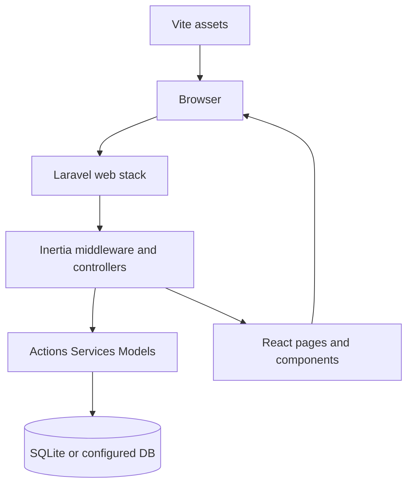
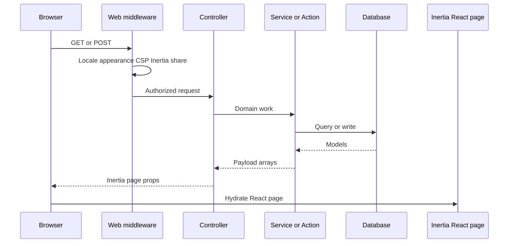
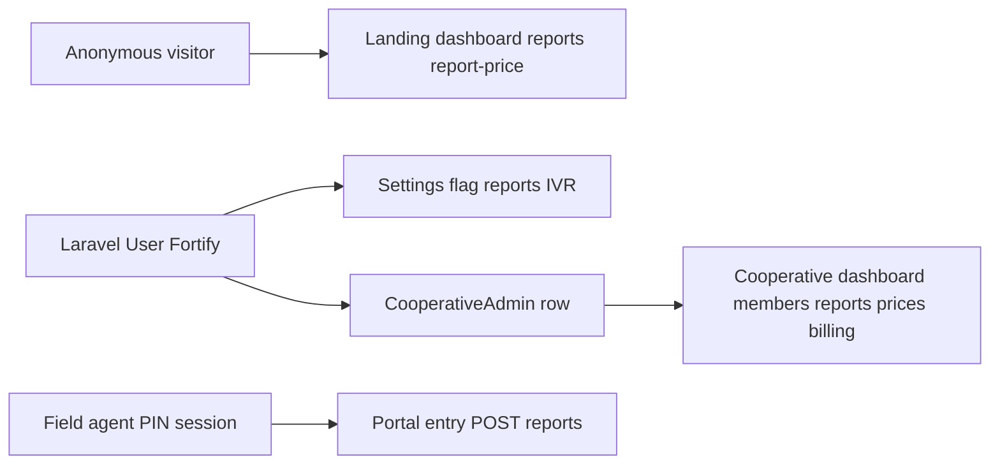
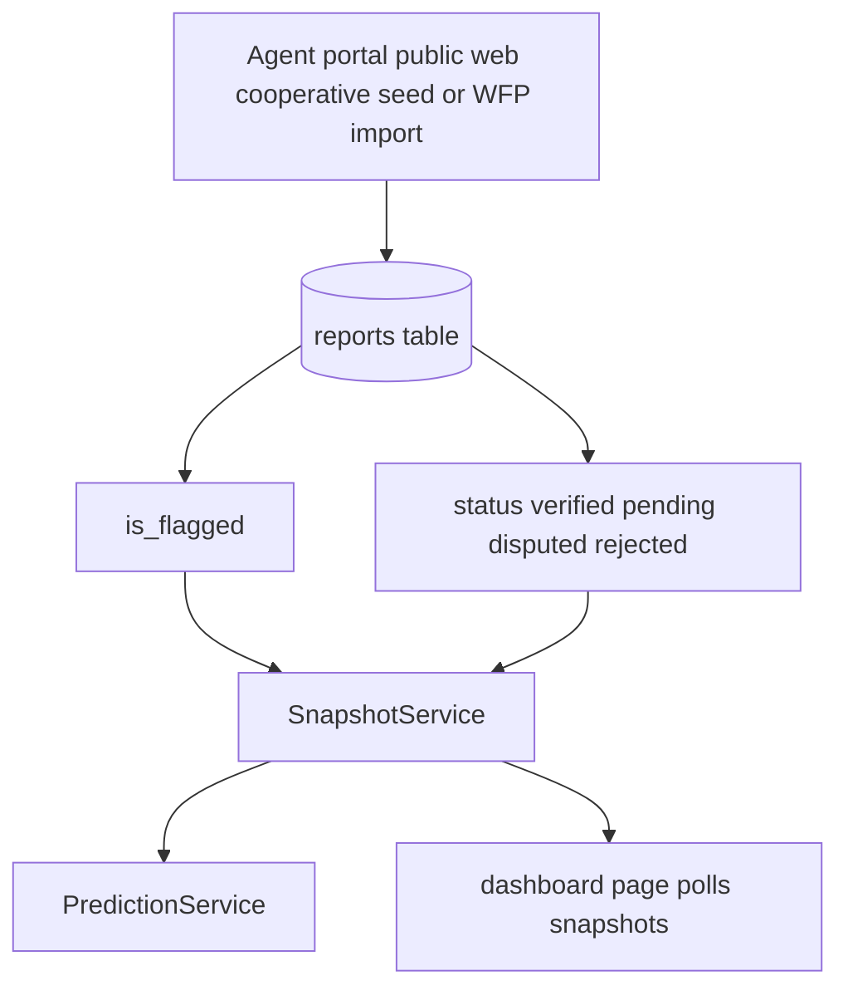

# Architecture

This document describes how AgriVoice is structured as a Laravel 13 + Inertia React 19 application, how requests move through the stack, and which packages own which responsibilities.

Related documents: [Documentation.md](Documentation.md) · [Backend-Reference.md](Backend-Reference.md) · [Frontend-Reference.md](Frontend-Reference.md) · [Security-and-Authentication.md](Security-and-Authentication.md)

---

## 1. System overview

AgriVoice is a **server-rendered Inertia SPA**, not a separate REST API plus SPA. Browser pages receive props from Laravel controllers; forms and mutations use Inertia visits (or Wayfinder-generated form helpers). There is **no** `routes/api.php`.

| Layer | Technology | Primary location |
| ----- | ---------- | ---------------- |
| HTTP / domain | Laravel 13, PHP ^8.3 | `app/`, `routes/`, `bootstrap/` |
| Auth (users) | Laravel Fortify + Passkeys | `app/Providers/FortifyServiceProvider.php`, `config/fortify.php` |
| Auth (agents) | Custom session (`AgentSession`) | `app/Services/AgentSession.php`, `EnsureAgentIsAuthenticated` |
| UI | React 19, Inertia 3, TypeScript | `resources/js/` |
| Styling | Tailwind CSS v4, semantic tokens | `resources/css/app.css` |
| Build | Vite 8, Wayfinder, React Compiler | `vite.config.ts`, `package.json` |
| Persistence | SQLite by default (configurable) | `config/database.php`, `database/` |
| Charts / map | Recharts, Leaflet (npm-bundled) | `resources/js/components/` |

---

## 2. Application boot pipeline

Boot is configured in [`bootstrap/app.php`](../bootstrap/app.php):

1. **Routing** — web routes from `routes/web.php` (which requires `portal.php` and `settings.php`), console routes from `routes/console.php`, health check at `GET /up`.
2. **Trust proxies** — `trustProxies(at: '*')` so HTTPS and client IPs work behind Railway/Fly/Nginx/Cloudflare.
3. **Cookie encryption exceptions** — `appearance`, `locale`, and `sidebar_state` stay readable by the frontend without CSRF gymnastics.
4. **Web middleware append** (every browser request):
   - `HandleAppearance` — dark/light appearance cookie → root view
   - `SetLocale` — `en` / `am` / `om` from cookie
   - `HandleInertiaRequests` — shared props (auth, translations, flash)
   - `AddLinkHeadersForPreloadedAssets` — HTTP/2 preload hints
   - `SecurityHeaders` — CSP and baseline browser hardening
5. **Aliases**:
   - `agent` → `EnsureAgentIsAuthenticated`
   - `cooperative.admin` → `EnsureCooperativeAdmin`
6. **JSON exceptions** — rendered as JSON for `api/*` or `expectsJson()` requests (Inertia visits typically send Accept JSON; there is still no public JSON API surface).

[`app/Providers/AppServiceProvider.php`](../app/Providers/AppServiceProvider.php) additionally:

- Registers `AgentSession` as **scoped** (one instance per request; safe for Octane).
- Forces immutable Carbon dates.
- Prohibits destructive DB commands in production.
- Forces HTTPS URLs and secure cookies in production.
- Configures named rate limiters: `public-report`, `cooperative-login`, `cooperative-register`.
- Pins `php artisan serve` to `127.0.0.1:8000` so Laravel and Vite share IPv4 loopback.

---

## 3. Request lifecycle (typical Inertia page)

Mutation pattern:

1. Form request validates and authorizes.
2. Controller/action performs the write (often in a DB transaction).
3. Response is usually `redirect()->back()` or a named route with flash `success` / `error`.
4. Frontend toast layer (`use-flash-toast`) reads shared flash props via Sonner.

---

## 4. Frontend boot and layout resolution

Entry: [`resources/js/app.tsx`](../resources/js/app.tsx) via Vite input `resources/js/app.tsx` + `resources/css/app.css`.

| Inertia page name pattern | Layout |
| ------------------------- | ------ |
| `welcome`, `report-price`, `portal/*` | None (page owns chrome) |
| `auth/*`, `Cooperative/auth/*` | `AuthLayout` → `auth/auth-simple-layout` |
| `settings/*` | `[AppLayout, SettingsLayout]` |
| Everything else | `AppLayout` → sidebar shell |

`portal/entry` returns `null` from the global layout resolver but wraps itself in [`layouts/portal-layout.tsx`](../resources/js/layouts/portal-layout.tsx).

Shared Inertia props ([`HandleInertiaRequests`](../app/Http/Middleware/HandleInertiaRequests.php)):

| Prop | Purpose |
| ---- | ------- |
| `name` | `config('app.name')` |
| `auth.user` | Fortify-authenticated user or null |
| `locale` | Current locale |
| `translations` | Full JSON dictionary for locale |
| `sidebarOpen` | From `sidebar_state` cookie |
| `flash.success` / `flash.error` / `flash.bulkInviteSummary` | Toast and invite feedback |

Root Blade shell: [`resources/views/app.blade.php`](../resources/views/app.blade.php) — favicons, Vite tags, Inertia root.

---

## 5. Wayfinder and typed routes

[`@laravel/vite-plugin-wayfinder`](../vite.config.ts) generates TypeScript route helpers under `resources/js/actions` and `resources/js/routes` (build-time). Frontend pages should call those helpers rather than hardcoding paths. Controllers still define the authoritative route table in PHP.

---

## 6. Domain layering conventions

| Concern | Prefer | Avoid |
| ------- | ------ | ----- |
| Multi-step writes | `app/Actions/*` | Fat controllers |
| Aggregates / query payloads | `app/Services/*` | Duplicating SQL in pages |
| Validation + auth for a form | `app/Http/Requests/*` | Inline validation in controllers |
| Tenant authorization | Policies + `cooperative.admin` | Trusting client cooperative IDs |
| Enumerated values | `app/Enums/*` | Magic strings in new code |
| CamelCase Inertia props | Resources or explicit arrays | Leaking snake_case inconsistently |

Important services:

| Service | Responsibility |
| ------- | -------------- |
| `SnapshotService` | Live dashboard price tiles (weighted average + confidence) |
| `PredictionService` | Deterministic 7-day vs previous 7-day trend heuristic |
| `ReportEntryService` | Portal report persistence + attribution |
| `CooperativeDashboardService` | Cooperative KPI / trend payloads |
| `CooperativeReportsService` | Filtered report index + CSV |
| `CooperativePriceService` | Member vs regional price summary |
| `CooperativeMembersService` | Member roster, detail, filters |
| `AgentSession` | Agent identity for portal middleware/controllers |
| `IvrScriptBuilder` / `AmharicNumberSpeech` | Convert snapshots into TTS-safe Amharic scripts |
| `IvrAudioCatalog` / `AddisAiVoiceService` | Fixed/dynamic IVR audio and Addis API adapter |

---

## 7. Identity boundaries

AgriVoice has **three separate identity modes**:

1. **Anonymous / guest** — public landing, live dashboard, live report feed (read), public report form.
2. **Agent** — not a `User`; name + 4-digit PIN stored on `agents`, session key managed by `AgentSession`.
3. **User (Fortify)** — email/password (+ optional 2FA/passkeys). Cooperative access additionally requires a `cooperative_admins` row (`cooperative.admin` middleware).

Details: [Security-and-Authentication.md](Security-and-Authentication.md).

---

## 8. Data flow: from report to dashboard tile

The IVR page consumes the same snapshot service as the dashboard, then builds
Amharic scripts for four crops. Dynamic TTS is an external server-to-server
call to Addis AI and cached on Laravel's public disk. WFP import is an offline
seeding path into the same reports table; it is not a runtime market API.

Rules encoded in code:

- Aggregates use `Report::verified()->notFlagged()` and a trailing lookback window.
- Displayed prices are **never** a stored column; they are computed on read.
- Portal submissions are created as `verified` with `source = agent_portal`.
- Public web submissions are `pending` with `source = public_web` and therefore **excluded** from snapshots until verified.

---

## 9. Frontend architecture notes

- **Polling, not websockets** — `dashboard` and `reports` use Inertia `usePoll(2500)` with `only: [...]` and `mode: 'rest'`.
- **Design system** — semantic CSS variables in `resources/css/app.css` (primary leaf-green, foreground/background, muted, destructive). Prefer tokens over raw emerald/zinc utilities.
- **Shared domain helpers** — `resources/js/lib/agrivoice.ts` for crop/market labels, `formatPrice`, `formatCurrency`, relative time.
- **Motion** — `AnimateIn` / `PageSection` for entrance animation; respects `prefers-reduced-motion` via CSS.
- **i18n** — full JSON dictionaries shared as props; `useTranslations()` looks up keys with simple `:placeholder` replacement (no ICU plurals).

---

## 10. Build and asset pipeline

[`vite.config.ts`](../vite.config.ts):

- Inputs: `resources/css/app.css`, `resources/js/app.tsx`
- Plugins: Laravel Vite, Inertia, React (+ React Compiler Babel plugin), Tailwind v4, Wayfinder (`formVariants: true`)
- Dev server pinned to `127.0.0.1:5173` (`strictPort: true`) so `public/hot` and CSP agree

Production: `npm run build` emits hashed assets under `public/build/`. CSP in production allows `'self'` scripts/styles (plus Bunny fonts and OSM tiles for maps); local Vite origins are allowed only when not production.

---

## 11. Dependency map (application-relevant)

### PHP (`composer.json`)

| Package | Role |
| ------- | ---- |
| `laravel/framework` ^13 | Core |
| `inertiajs/inertia-laravel` ^3 | Inertia server adapter |
| `laravel/fortify` | User auth flows |
| `laravel/wayfinder` | Typed frontend routes |
| `barryvdh/laravel-dompdf` | Cooperative price PDF download |
| `pestphp/pest` | Tests |
| `larastan/larastan` | Static analysis (`composer types:check`) |
| `laravel/pint` | PHP formatting |

### JS (`package.json`)

| Package | Role |
| ------- | ---- |
| `react` / `react-dom` 19 | UI |
| `@inertiajs/react` 3 | SPA bridge |
| `tailwindcss` 4 / `@tailwindcss/vite` | Styling |
| `recharts` | Cooperative/farmer charts |
| `leaflet` | Market map |
| `sonner` | Toasts |
| `papaparse` | Bulk CSV invite client parsing |
| `lucide-react` | Icons |
| Radix / shadcn-style `components/ui/*` | Primitives |

---

## 12. Explicit non-goals of the current architecture

Documented so readers do not confuse marketing copy with runtime behavior:

| Claim / UI hint | Actual architecture |
| --------------- | ------------------- |
| Voice-first product | No STT/TTS pipeline; landing demo is timed text |
| “AI understands intent” | Not implemented as a model call |
| Live price heat maps / WhatsApp / SMS | Roadmap copy on landing only |
| Payment processing | Mock payment method fields on subscription |
| Real-time push | 2.5s polling |
| Public REST API | None |

---

## 13. Key source index

| Area | Paths |
| ---- | ----- |
| Boot | `bootstrap/app.php`, `app/Providers/AppServiceProvider.php`, `app/Providers/FortifyServiceProvider.php` |
| Routes | `routes/web.php`, `routes/portal.php`, `routes/settings.php` |
| Domain services | `app/Services/*.php` |
| Actions | `app/Actions/*.php` |
| Frontend entry | `resources/js/app.tsx`, `resources/views/app.blade.php` |
| Tokens / CSS | `resources/css/app.css` |
| Config | `config/*.php`, `.env.example` |
