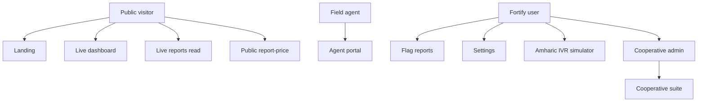

# AgriVoice — Technical Documentation

**AgriVoice** is a Laravel 13 + Inertia React 19 application that aggregates crowd- and agent-reported crop prices for Ethiopian markets, scores confidence, surfaces trends, and provides a cooperative administration suite.

This file is the **documentation hub**. Detailed topics live in sibling documents under [`agrivoice/DOCS/`](./).

> **Honesty rule:** Landing and vision copy describe a voice-first future. The **implemented** product is a multilingual web reporting + analytics system with a simulated voice demo. Trends are deterministic heuristics, not trained ML. Billing payment methods are mock/display-only.

---

## Table of contents

1. [Documentation map](#1-documentation-map)
2. [Product scope](#2-product-scope)
3. [Actors](#3-actors)
4. [Architecture at a glance](#4-architecture-at-a-glance)
5. [Quick start](#5-quick-start)
6. [Demo credentials](#6-demo-credentials)
7. [Key URLs](#7-key-urls)
8. [Domain snapshot](#8-domain-snapshot)
9. [Core algorithms](#9-core-algorithms)
10. [Data entry contracts](#10-data-entry-contracts)
11. [Cooperative suite](#11-cooperative-suite)
12. [Frontend surface](#12-frontend-surface)
13. [Security summary](#13-security-summary)
14. [Testing and quality](#14-testing-and-quality)
15. [What is not implemented](#15-what-is-not-implemented)
16. [Source of truth conventions](#16-source-of-truth-conventions)
17. [Legacy portal notes](#17-legacy-portal-notes)
18. [Glossary](#18-glossary)

---

## 1. Documentation map

| Document | Contents |
| -------- | -------- |
| **[Documentation.md](Documentation.md)** (this file) | Hub, overview, credentials, contracts summary |
| **[Architecture.md](Architecture.md)** | Boot pipeline, layering, Inertia/Vite, diagrams |
| **[Domain-and-Database.md](Domain-and-Database.md)** | Enums, schema, ER diagram, seeds, snapshot math |
| **[Features-and-Flows.md](Features-and-Flows.md)** | Actor journeys and maturity matrix |
| **[Backend-Reference.md](Backend-Reference.md)** | Routes, controllers, requests, actions, services, policies |
| **[Frontend-Reference.md](Frontend-Reference.md)** | Pages, layouts, components, types, polling, i18n |
| **[Security-and-Authentication.md](Security-and-Authentication.md)** | Auth modes, CSP/CORS, threats, tenant isolation |
| **[Development-Testing-and-Operations.md](Development-Testing-and-Operations.md)** | Setup, env, scripts, tests, deploy, troubleshooting |
| **[IVR-and-WFP-Integration.md](IVR-and-WFP-Integration.md)** | Amharic IVR/TTS and optional WFP historical import |

Team process docs also exist at the **repository root** under `/DOCS/` (commit/testing/programming rules). Product architecture docs live here under `agrivoice/DOCS/`.

---

## 2. Product scope

### Implemented

- Public marketing landing (EN / AM / OM) with simulated demo walkthrough
- Live price dashboard (7 crops × 3 markets) with confidence and trends
- Live report feed with outlier flagging (authenticated)
- Public price submission (pending until verified)
- Agent PIN portal for verified crowd/official entry
- Authenticated Amharic browser IVR for four live crop prices, with optional Addis AI TTS
- Optional idempotent WFP Ethiopia wholesale-price history import
- Farmer Fortify account + settings (profile, security, appearance, 2FA/passkeys)
- Cooperative registration/login and admin app: dashboard, members, reports, prices, mock billing
- CSV export, price PDF download, security headers, rate limits, feature tests

### Explicitly out of scope today

- Real speech recognition / synthesis pipeline
- Telephone carrier/SIP/USSD delivery (the IVR is a browser simulation)
- Browser STT/chat flow (service methods exist but are not routed)
- WhatsApp / Telegram / SMS channels as live integrations
- Payment provider charges and subscription automation
- Public JSON API (`routes/api.php` absent)
- WebSocket push (uses 2.5s Inertia polling)

---

## 3. Actors



| Actor | Auth | Entry |
| ----- | ---- | ----- |
| Public visitor | None | `/`, `/dashboard`, `/reports`, `/report-price` |
| Field agent | Name + PIN (`agents`) | `/portal/login` |
| Farmer / moderator | Email + password | `/login` |
| Cooperative admin | User + `cooperative_admins` | `/cooperative/login` |

---

## 4. Architecture at a glance

| Layer | Stack |
| ----- | ----- |
| Backend | Laravel 13, Fortify, Wayfinder, DomPDF, Pest |
| Bridge | Inertia Laravel ↔ `@inertiajs/react` |
| Frontend | React 19, TypeScript, Tailwind v4, Recharts, Leaflet |
| Default DB | SQLite |

Request path: Browser → web middleware (locale, appearance, Inertia share, CSP) → controller/form request → action/service → Eloquent → Inertia props → React page.

Full detail: [Architecture.md](Architecture.md).

---

## 5. Quick start

```bash
cd agrivoice
composer run setup
php artisan migrate:fresh --seed
composer run dev
```

Open http://127.0.0.1:8000

If the UI is unstyled: ensure Vite is running **or** run `npm run build`, use `127.0.0.1` (not mixed `localhost`), hard-refresh. See [Development-Testing-and-Operations.md](Development-Testing-and-Operations.md).

---

## 6. Demo credentials

| Surface | Credentials |
| ------- | ----------- |
| Agent portal | Tsegaye / `1111` · Gezachew / `2222` · Nati / `3333` · Nba / `4444` |
| Cooperative | `coop.owner@gmail.com` / `password` |
| Farmer / moderator | `test@example.com` / `password` |

These are **fixtures** shipped by seeders (`AgentSeeder`, `CooperativeDemoSeeder`, `DatabaseSeeder`), not production secrets.

---

## 7. Key URLs

| Path | Purpose |
| ---- | ------- |
| `/` | Landing |
| `/dashboard` | Live price tiles + map + trends (public) |
| `/reports` | Live feed (flag requires login) |
| `/report-price` | Public submission |
| `/ivr` | Authenticated Amharic keypad IVR simulator |
| `/portal/login` | Agent entry |
| `/cooperative/login` | Cooperative admin |
| `/cooperative/dashboard` | Coop KPIs |
| `/settings/profile` | Account settings |
| `/up` | Health check |

Complete route tables: [Backend-Reference.md](Backend-Reference.md).

---

## 8. Domain snapshot

**Crops:** teff, coffee, maize, wheat, sesame, pulses, sorghum

**Markets:** Adama, Addis Ababa, Jimma (slugs `adama`, `addis_ababa`, `jimma`)

**Central fact table:** `reports` — price in ETB/quintal with `reporter_type`, optional `agent_id` / `cooperative_member_id`, `reported_at`, `is_flagged`, `status`.

Displayed dashboard prices are **derived aggregates**, never a stored “current price” column.

Schema, ER diagram, seeds: [Domain-and-Database.md](Domain-and-Database.md).

---

## 9. Core algorithms

Implemented in `app/Services/SnapshotService.php` and `PredictionService.php`.

| Concept | Rule |
| ------- | ---- |
| Window | Last 14 days; `verified` + `notFlagged` |
| Weight | \(0.5^{hours/72} \times\) reporter weight (official 1.5, crowd 1.0) |
| Price | Weighted average of report prices |
| Confidence | Count (≤40) + recency (≤30) + agreement/CV (≤30) |
| Trend | Mean(last 7d) vs mean(prev 7d); ±2% band → stable |

Cooperative prices use trailing 7-day member averages vs regional averages (markets with matching `region`). See Domain doc for formulas.

---

## 10. Data entry contracts

### Agent portal — `POST /reports`

| Field | Rules |
| ----- | ----- |
| `crop` | Required enum |
| `market` | Required market slug |
| `price` | Numeric, > 0, < 100000; commas allowed |
| `reporter_type` | `official` \| `crowd` |
| `reported_at` | Date within last year, not future |

- `agent_id` from session only (`ReportEntryService`)
- Stored as `source = agent_portal`, `status = verified`
- Same-day timestamps use “now”; backdates use start of day

### Public web — `POST /report-price`

- Same crop/market/price/date ideas without reporter_type (forced `crowd`)
- `source = public_web`, `status = pending`, attributed to seeded Public Submission agent
- Throttled 10/min/IP
- Pending rows **do not** affect dashboard aggregates (`verified` scope)
- Appear in the public `/reports` feed immediately
- **No current verify path** for these rows (coop moderation is member-scoped; live-list only flags). Dashboard inclusion after public submit is not implemented yet.

### Live list field mapping

`ReportResource` maps DB → camelCase. TypeScript `ReportRowData.source` carries **reporter_type** (`official`/`crowd`). Keep `resources/js/types/agrivoice.ts` aligned when changing resources.

---

## 11. Cooperative suite

| Module | Capabilities |
| ------ | ------------ |
| Auth | Gmail-only register; login; owner + Starter plan created transactionally |
| Dashboard | Weekly prices, activity KPIs, actual/forecast charts |
| Members | Search/filter, invite, bulk CSV, detail sheet, soft remove |
| Reports | Filter, paginate, status + reason, audit trail, CSV export |
| Prices | Member vs regional benchmark, PDF |
| Billing | Plan display, pending plan change, **mock** payment method, invoices |

Invites dispatch `SendMemberInviteJob`, which currently **logs** rather than sending SMS.

Flows: [Features-and-Flows.md](Features-and-Flows.md).

---

## 12. Frontend surface

- Layouts resolved in `resources/js/app.tsx`
- Design tokens in `resources/css/app.css` (black/white/leaf-green)
- i18n via shared `lang/{en,am,om}.json` + `useTranslations()`
- Dashboard & reports poll every **2.5 seconds**
- Shared primitives: `PageHeader`, `TablePagination`, `StatusBadge`, `Textarea`
- Landing demo is frontend-simulated only

Details: [Frontend-Reference.md](Frontend-Reference.md).

---

## 13. Security summary

- Three auth modes (guest / agent session / Fortify user ± coop admin)
- Cooperative tenant isolation via middleware + policies + query scopes
- CSP, frame/nosniff/referrer/permissions headers, HSTS in production
- Explicit CORS origins; trusted proxies for TLS termination
- Rate limits on public and guest write endpoints
- Production password policy tightened; HTTPS URLs forced

Full write-up: [Security-and-Authentication.md](Security-and-Authentication.md).

---

## 14. Testing and quality

```bash
php artisan test --compact
composer test          # Pint + PHPStan + Pest
npm run types:check
npm run format:check
```

Coverage spans portal, public reports, snapshots, cooperative modules, and security hardening. There is no in-repo React component test suite.

Ops detail: [Development-Testing-and-Operations.md](Development-Testing-and-Operations.md).

---

## 15. What is not implemented

| Appearance in UI / copy | Reality |
| ----------------------- | ------- |
| Voice questions & spoken answers | Simulated text demo; no STT/TTS |
| “AI understands intent” | No model inference pipeline |
| WhatsApp / SMS / heat maps / marketplace | Vision list only |
| Live Telebirr/Chapa charging | Mock payment method fields |
| WebSocket live updates | Inertia polling |
| Default ML `predictions` seed | Optional; not in `DatabaseSeeder` |
| Telephone IVR | Authenticated browser keypad + Addis TTS only |
| WFP import as live feed | Optional historical CSV seed; current tiles still use trailing 14 days |

---

## 16. Source of truth conventions

| Concern | Canonical location |
| ------- | ------------------ |
| HTTP routes | `routes/*.php` |
| Aggregates | `SnapshotService`, `PredictionService` |
| Portal writes | `ReportEntryService` |
| Enums | `app/Enums/*` |
| TS domain types | `resources/js/types/agrivoice.ts` (+ cooperative types) |
| Labels/formatters | `resources/js/lib/agrivoice.ts` |
| Copy / i18n | `lang/en.json` (then am/om) |
| Demo data | `database/seeders/*` |

When changing a contract, update **backend + TypeScript types + this documentation set** together.

---

## 17. Legacy portal notes

Earlier slice docs described only the agent portal. Those contracts remain valid and are subsumed here:

- Shared schema: `agents`, `markets`, `reports` (plus later cooperative columns)
- Portal endpoints and PIN table (see §6 and §10)
- Reusable pieces: `resources/js/components/reports/report-row.tsx`, `lib/agrivoice.ts`, `AgentSession`

Cooperative, public reporting, security hardening, and UI polish are documented in the sibling files rather than as additive “slice” sections.

---

## 18. Glossary

| Term | Definition |
| ---- | ---------- |
| Quintal | Price unit used throughout (ETB per quintal) |
| Snapshot | Derived crop×market tile for the public dashboard |
| Flagged | Soft-excluded from aggregates |
| Verified | Moderation status eligible for aggregates |
| Agent | PIN identity for field data entry |
| Cooperative admin | Fortify user linked via `cooperative_admins` |
| Member query | Stored query row (often channel `voice`) used for coop analytics demos |

---

## Maintaining this documentation

- Prefer updating the specific sibling doc for deep changes; keep this hub accurate for credentials, URLs, maturity claims, and links.
- Do not describe roadmap marketing as shipped behavior.
- After large features, re-run a quick inventory against `routes/web.php`, `routes/portal.php`, seeders, and `resources/js/pages/`.
