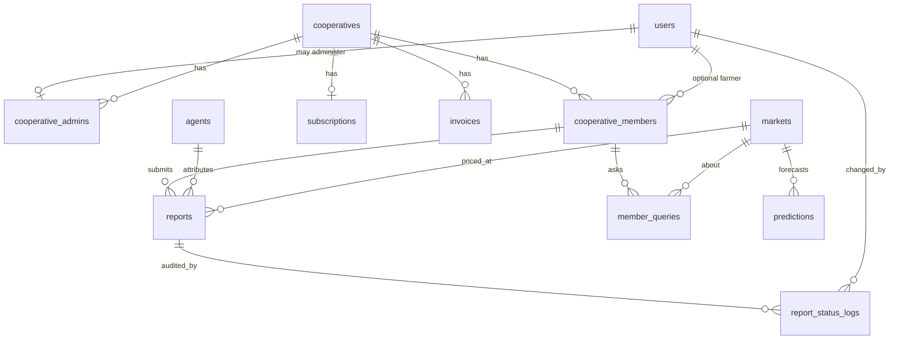
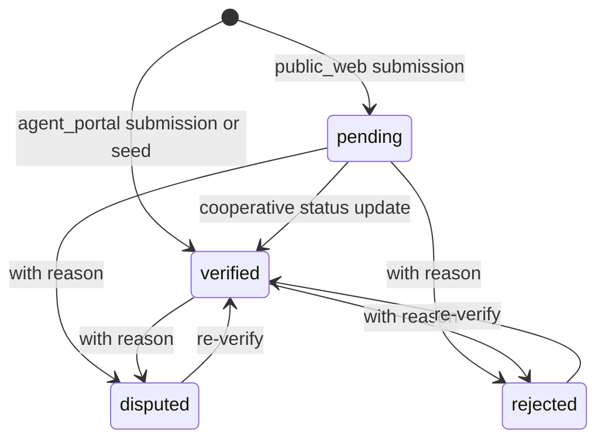

# Domain and Database

Source of truth for AgriVoice’s domain model: enums, tables, relationships, scopes, seed data, and factories.

Related documents: [Documentation.md](Documentation.md) · [Features-and-Flows.md](Features-and-Flows.md) · [Backend-Reference.md](Backend-Reference.md)

---

## 1. Domain vocabulary

| Term | Meaning in this codebase |
| ---- | ------------------------ |
| **Crop** | One of seven supported commodities (`Crop` enum) |
| **Market** | Geographic trading hub with slug, region, and map coordinates |
| **Report** | A single observed price (ETB per quintal) attributed to an agent and/or cooperative member |
| **Snapshot** | Derived aggregate for one crop×market tile (not stored) |
| **Confidence** | 0–100 quality score derived from count, recency, and agreement |
| **Trend** | Up / Down / Stable from a 7-day vs previous-7-day average comparison |
| **Agent** | Field data-entry identity (PIN), not a Laravel `User` |
| **User** | Fortify account (farmer/moderator/coop owner) |
| **Cooperative** | Tenant organization with region and default crops |
| **Cooperative admin** | `User` linked via `cooperative_admins` |
| **Member** | Farmer roster entry for a cooperative (phone + status) |
| **Member query** | Seeded/placeholder “question” record (channel often `voice`) — not a live voice pipeline |
| **Prediction row** | Stored forecast point for charts; demo seed optional |
| **Flagged** | Soft-excluded from aggregates (`is_flagged = true`) |
| **Status** | Moderation state: pending / verified / disputed / rejected |

---

## 2. Enums

All under [`app/Enums/`](../app/Enums/).

### `Crop`

| Case | Value |
| ---- | ----- |
| Teff | `teff` |
| Coffee | `coffee` |
| Maize | `maize` |
| Wheat | `wheat` |
| Sesame | `sesame` |
| Pulses | `pulses` |
| Sorghum | `sorghum` |

### `MarketSlug`

| Case | Value |
| ---- | ----- |
| Adama | `adama` |
| AddisAbaba | `addis_ababa` |
| Jimma | `jimma` |

### `ReporterType`

| Case | Value | Weight in `SnapshotService` |
| ---- | ----- | --------------------------- |
| Official | `official` | 1.5 |
| Crowd | `crowd` | 1.0 |

### `Trend`

`up` · `down` · `stable`

### `ReportStatus`

| Case | Value | Included in dashboard aggregates? |
| ---- | ----- | --------------------------------- |
| Pending | `pending` | No (`verified()` scope) |
| Verified | `verified` | Yes (if not flagged) |
| Disputed | `disputed` | No |
| Rejected | `rejected` | No |

### Cooperative / billing enums

| Enum | Cases |
| ---- | ----- |
| `CooperativeAdminRole` | `owner`, `staff` |
| `CooperativeMemberStatus` | `active`, `invited`, `removed` |
| `PlanTier` | `starter` (ETB 2,500 / 100 members), `growth` (6,000 / 500), `scale` (12,000 / 2,000) |
| `SubscriptionStatus` | `active`, `past_due`, `cancelled` |
| `InvoiceStatus` | `paid`, `due`, `overdue` |

---

## 3. Entity relationship overview



---

## 4. Tables (migrations)

Paths under [`database/migrations/`](../database/migrations/).

### Framework / account

| Table | Migration | Notes |
| ----- | --------- | ----- |
| `users` | `0001_01_01_000000_create_users_table.php` | Fortify users |
| `password_reset_tokens` | same | |
| `sessions` | same | `SESSION_DRIVER=database` by default |
| `cache` / `cache_locks` | `0001_01_01_000001_create_cache_table.php` | |
| `jobs` / `job_batches` / `failed_jobs` | `0001_01_01_000002_create_jobs_table.php` | Used when queue ≠ sync |
| `passkeys` | `2024_01_01_000000_create_passkeys_table.php` | Laravel Passkeys |
| users 2FA columns | `2025_08_14_170933_add_two_factor_columns_to_users_table.php` | Fortify 2FA |

### Markets, agents, reports

#### `markets`

| Column | Type | Notes |
| ------ | ---- | ----- |
| `id` | id | |
| `slug` | string, unique | Cast to `MarketSlug` |
| `name` | string | |
| `region` | string | Used for cooperative regional benchmarks |
| `latitude` / `longitude` | decimal(10,7) | Leaflet markers |
| timestamps | | |

Saving/deleting a market clears `dashboard.markets` cache ([`Market`](../app/Models/Market.php)).

#### `agents`

| Column | Type | Notes |
| ------ | ---- | ----- |
| `id` | id | |
| `name` | string, unique | Login identifier |
| `pin` | string | Hashed cast |
| timestamps | | |

#### `reports`

Base: `2026_07_25_150200_create_reports_table.php`, then status + cooperative member migrations.

| Column | Type | Notes |
| ------ | ---- | ----- |
| `id` | id | |
| `crop` | string | Cast `Crop` |
| `market_id` | FK → markets, cascade | |
| `price` | decimal(10,2) | ETB / quintal |
| `reporter_type` | string | Cast `ReporterType` |
| `source` | string, nullable | e.g. `agent_portal`, `public_web`, seed provenance |
| `agent_id` | FK → agents, **nullable**, nullOnDelete | Originally required; softened for member reports |
| `cooperative_member_id` | FK → cooperative_members, nullable | Tenant attribution |
| `reported_at` | timestamp | Observation time |
| `is_flagged` | bool, default false | Aggregate exclusion |
| `status` | string, indexed, default `verified` | Cast `ReportStatus` |
| timestamps | | |

Indexes:

- `(crop, market_id, reported_at)` — snapshot query path
- `is_flagged` (added with flagging usage)
- `status`

### Cooperative domain

#### `cooperatives`

`name`, `region`, JSON `default_crops`, timestamps.

#### `cooperative_admins`

`cooperative_id`, `user_id` (unique — one admin row per user), `role` (`owner`/`staff`).

#### `cooperative_members`

`cooperative_id`, nullable `farmer_id` → users, nullable `name`, `phone_number`, unique `(cooperative_id, phone_number)`, `status`, `joined_at`, timestamps.

#### `member_queries`

`cooperative_member_id`, optional `crop` / `market_id` / `query_text`, `channel` (default `voice`), `queried_at`.

#### `predictions`

`crop`, `market_id`, `predicted_price`, `trend`, `confidence_score`, `predicted_for`, `generated_at`.

#### `report_status_logs`

`report_id`, `changed_by` (nullable user), `old_status`, `new_status`, `reason`, `created_at` (no `updated_at`).

#### `subscriptions`

One logical subscription per cooperative: `plan_tier`, `pending_plan_tier`, `price_per_month`, `member_limit`, `status`, `current_period_end`, display-only `payment_method_type` / `payment_method_last_four`.

#### `invoices`

`cooperative_id`, `amount`, `status`, `issued_at`, nullable `pdf_path` (local disk).

---

## 5. Model scopes and helpers (high signal)

### `Report` ([`app/Models/Report.php`](../app/Models/Report.php))

| Scope / relation | Behavior |
| ---------------- | -------- |
| `notFlagged()` | `is_flagged = false` |
| `verified()` | `status = verified` |
| `forCropMarket($crop, $marketId)` | Pair filter |
| `forCooperative($id)` | Via `cooperative_member.cooperative_id` |
| `statusLogs` | Newest first |

### `CooperativeMember`

| Scope | Behavior |
| ----- | -------- |
| `forCooperative($id)` | Tenant filter |
| `notRemoved()` | Excludes `removed` |
| `displayName()` | Member name or linked farmer name |

### Billing models

`Subscription::forCooperative`, `Invoice::forCooperative`.

---

## 6. Report lifecycle



Parallel flag axis (orthogonal to status):

- `is_flagged = false` → eligible for aggregates **if** also verified
- `is_flagged = true` → excluded forever from aggregates (flag action is idempotent; no unflag in product UI)

Audit: every cooperative status change goes through [`ChangeReportStatus`](../app/Actions/ChangeReportStatus.php) and writes `report_status_logs`.

---

## 7. Snapshot math (derived domain)

Implemented in [`SnapshotService`](../app/Services/SnapshotService.php) + [`PredictionService`](../app/Services/PredictionService.php).

### Window

- Lookback: **14 days** of verified, unflagged reports.

### Weighted price

\[
weight = 0.5^{(hoursAgo / 72)} \times reporterTypeWeight
\]

\[
price = \sum(price_i \times weight_i) / \sum(weight_i)
\]

### Confidence (0–100)

| Signal | Max points | Rule |
| ------ | ---------- | ---- |
| Count | 40 | 8 × min(reportCount, 5) |
| Recency | 30 | \(30 \times e^{-hoursSinceLatest / 48}\) |
| Agreement | 30 | \(30 \times (1 - \min(1, CV \times 2))\) where CV = stddev/mean |

### Trend

- Recent average: last 7 days (simple mean, not weighted)
- Previous average: days 14→7
- If either missing → `stable`, `changePercent = null`
- Else percent change; ≥ +2% → `up`, ≤ −2% → `down`, else `stable`

---

## 8. Cooperative pricing domain

[`CooperativePriceService`](../app/Services/CooperativePriceService.php):

| Series | Filter |
| ------ | ------ |
| Cooperative current price | Member reports of this coop, verified, unflagged, trailing 7 days, coop region markets, default crops |
| Previous week (trend) | Same filters, prior 7-day window |
| Regional average | **All** verified/unflagged reports in markets whose `region` exactly matches the cooperative’s region (not limited to one coop) |

---

## 9. Seeders and demo data

Root: [`DatabaseSeeder`](../database/seeders/DatabaseSeeder.php)

```
User factory → test@example.com
→ MarketSeeder
→ AgentSeeder
→ ReportSeeder
→ CooperativeDemoSeeder
```

### Demo credentials (fixtures, not secrets)

| Surface | Identity | Secret |
| ------- | -------- | ------ |
| Farmer / moderator | `test@example.com` | `password` |
| Agent portal | Tsegaye / Gezachew / Nati / Nba | `1111` / `2222` / `3333` / `4444` |
| Public submission agent | `Public Submission` | `0000` (internal attribution only) |
| Cooperative owner | `coop.owner@gmail.com` | `password` |

### What `ReportSeeder` guarantees

- Coverage across **7 crops × 3 markets**
- ~13 days of deterministic history (reproducible, not random)
- Uneven report counts so confidence varies
- Gentle upward drift so trends appear
- Two deliberate **unflagged** outliers for the flagging demo

### What `CooperativeDemoSeeder` guarantees

- Cooperative **Oromia Coffee Growers**
- Owner admin linked to `coop.owner@gmail.com`
- Mix of active / invited / removed members
- Member reports (verified + pending) and member queries
- Growth plan subscription + sample invoices

### Seeders **not** called by `DatabaseSeeder`

Including `PredictionSeeder`, `MemberQuerySeeder` (standalone), `SubscriptionSeeder`, and `WfpFoodPricesSeeder`. Cooperative trend charts that join `predictions` will show forecasts only if prediction rows exist (demo dashboard still works for actuals from reports).

`WfpFoodPricesSeeder` streams the committed
`database/data/wfp_food_prices_eth.csv`, filters it to supported markets,
commodities, wholesale ETB actuals, normalizes `KG`/`100 KG` to ETB per
quintal, and inserts verified official reports in chunks of 500:

```bash
php artisan db:seed --class=WfpFoodPricesSeeder
```

It first deletes prior `source=wfp_food_prices` rows, making the import
idempotent. Historic rows do not affect current dashboard snapshots unless
their `reported_at` falls inside the trailing 14-day window. See
[IVR-and-WFP-Integration.md](IVR-and-WFP-Integration.md) for exact mappings.

---

## 10. Factories

Under [`database/factories/`](../database/factories/):

`UserFactory`, `AgentFactory`, `MarketFactory`, `ReportFactory`, `CooperativeFactory`, `CooperativeAdminFactory`, `CooperativeMemberFactory`, `MemberQueryFactory`, `PredictionFactory`, `ReportStatusLogFactory`, `SubscriptionFactory`, `InvoiceFactory`.

Factories provide test states such as `ReportFactory::pending()`, `::verified()`, `::fromMember()`, member status states, and invoice paid/due/overdue.

---

## 11. Source provenance values (informal contract)

Common `reports.source` strings used in code/seeds:

| Value | Meaning |
| ----- | ------- |
| `agent_portal` | Created via authenticated agent entry (`ReportEntryService::PORTAL_SOURCE`) |
| `public_web` | Created via `/report-price` |
| `wfp_food_prices` | Optional WFP Ethiopia historical wholesale import |
| `null` / seed tags | Reference/seeded history (`wfp`, `ecx`, etc. may appear in seeds) |

Attribution rules:

- Portal: `agent_id` from session only.
- Public: attributed to seeded Public Submission agent; status `pending`.
- Cooperative member reports: `cooperative_member_id` set; used for tenant scoping.

---

## 12. Indexes and performance notes

- Dashboard poll uses **one** grouped query for all crop×market pairs in `SnapshotService::all()` (avoids N×M queries).
- Trend for dashboard uses in-memory `trendFromReports()` to avoid ~42 extra SQL queries per poll.
- Cooperative exports stream CSV with `chunkById(200)`.
- Market list for dashboard markers is cacheable (`dashboard.markets`).
