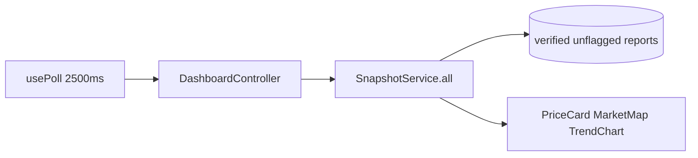
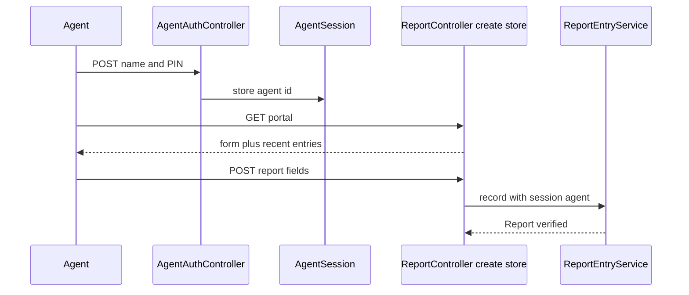

# Features and Flows

End-to-end product behavior by actor. Each section states what is **implemented**, what is **seeded/demo**, and what is **mock/roadmap**.

Related documents: [Documentation.md](Documentation.md) · [Domain-and-Database.md](Domain-and-Database.md) · [Backend-Reference.md](Backend-Reference.md) · [Frontend-Reference.md](Frontend-Reference.md)

---

## 1. Actor map

| Actor | How they authenticate | Primary surfaces |
| ----- | --------------------- | ---------------- |
| Public visitor | None | `/`, `/dashboard`, `/reports` (read), `/report-price` |
| Field agent | Name + PIN (`AgentSession`) | `/portal/login`, `/portal` |
| Farmer / moderator user | Fortify email/password | `/login`, `/reports` (flag), `/ivr`, `/settings/*` |
| Cooperative admin | Fortify user + `cooperative_admins` row | `/cooperative/*` |

---

## 2. Public landing

**Implemented**

- Marketing page at `/` → Inertia `welcome`.
- Current sections: hero, services, practical market information, story/mission, testimonials, CTA, footer (`resources/js/components/landing/*`).
- Language switcher + appearance toggle.
- Navigation to agent portal, cooperative login, report-price, live dashboard.

**Simulated / roadmap**

- “Play demo” is a **frontend-only** timed conversation (`landing/demo.tsx`), labeled “Simulated demo — no live audio.”
- Vision bullets (WhatsApp, SMS, heat maps, marketplace) are product vision, not live features.

---

## 3. Live price dashboard (projector)

**Route:** `GET /dashboard` → `DashboardController` → page `dashboard`.

**Implemented**

- Public (no login).
- Props: `snapshots` (21 crop×market tiles), `markets` (markers).
- Frontend polls every **2.5s** with `only: ['snapshots']`.
- UI: price cards, Leaflet map popups, trend chart.
- Aggregates from `SnapshotService` / `PredictionService` over verified, unflagged reports.

**Not implemented**

- WebSockets / server push.
- ML forecasting (trend is a deterministic heuristic).

---

## 4. Live report feed and flagging

**Routes**

| Method | Path | Auth |
| ------ | ---- | ---- |
| GET | `/reports` | Public read |
| POST | `/reports/{report}/flag` | `auth` + `verified` + throttle 20/min |

**Implemented**

- Lists recent reports via `ReportResource`.
- Client-side filters (crop, market, flagged-only) on the React page.
- Polling every 2.5s for `reports` prop.
- Flagging via `FlagReport` action — sets `is_flagged = true` idempotently; flagged rows drop out of aggregates.

**Caveats**

- Flag endpoint does **not** go through `ReportPolicy`; any authenticated verified user can flag.
- No unflag UI/action.
- `User` does not implement `MustVerifyEmail`, so `verified` middleware is often trivially satisfied for seeded/demo users.

---

## 5. Public price submission

**Routes:** `GET|POST /report-price` (POST throttled `public-report`: 10/min/IP).

**Implemented**

- Guest form: crop, market, price, observed date.
- Creates report with `reporter_type = crowd`, `source = public_web`, `status = pending`, attributed to seeded **Public Submission** agent.
- Pending reports do **not** affect dashboard aggregates (`SnapshotService` requires `verified`).
- Public submissions still appear in the unfiltered public `/reports` feed.

**Gap (important)**

- There is currently **no implemented verifier path** for public-web reports: they have no `cooperative_member_id`, cooperative moderation policies require a same-coop member report, and the global live-list action only **flags** (does not verify status).
- UI copy that a moderator will review the submission before it appears on the live dashboard is therefore aspirational relative to today’s code.

**Frontend:** `resources/js/pages/report-price.tsx` — localized, branded, distinct crop icons.

---

## 6. Agent data-entry portal

**Routes:** see [Backend-Reference.md](Backend-Reference.md) portal section.

**Implemented**

- Login roster of seeded agents; PIN hashed on model.
- Throttle login 10/min; store reports 30/min.
- Form validates via `StoreReportRequest`.
- `agent_id` stamped from session only.
- Same-day `reported_at` uses current time; backdated uses start of day.
- Status set to **verified** immediately (`ReportEntryService`).
- Portal layout separate from farmer app shell.

**Not implemented**

- Agent self-signup, password reset, roles, or Fortify integration.

---

## 7. Farmer / moderator Fortify account

**Implemented (starter-kit + AgriVoice wiring)**

- Register / login / logout / password reset / email verification screens / 2FA / passkeys / profile / security / appearance.
- After login, custom `LoginResponse` can route cooperative admins appropriately.
- Settings under `/settings/*`.
- Flagging on live list (see §4).

**Demo user:** `test@example.com` / `password`.

---

## 8. Cooperative registration and login

**Routes:** `/cooperative/login`, `/cooperative/register` (guest + named throttles), logout.

**Implemented**

- Login: email/password via `CooperativeLoginRequest` → session auth → must be cooperative admin to use `/cooperative/*`.
- Register: `RegisterCooperative` action creates cooperative, owner user (auto `email_verified_at`), owner admin row, Starter subscription — **Gmail-only** emails.
- Middleware `cooperative.admin` loads cooperative onto the request.

**Demo:** `coop.owner@gmail.com` / `password` from `CooperativeDemoSeeder`.

---

## 9. Cooperative dashboard

**Route:** `GET /cooperative/dashboard`.

**Implemented**

- Weekly price cards for member reports (current calendar week vs previous).
- Member activity KPIs: total members, active members, queries, reports (7-day windows with % change).
- Deferred trend series: actual daily averages from member reports + forecast points from `predictions` table when present.
- Tenant isolation: only this cooperative’s member-attributed data.

**Seeded / optional**

- `MemberQuery` activity is seeded for demos; there is no live voice query ingestion.
- Forecast line depends on `predictions` rows (not created by default `DatabaseSeeder`).

---

## 10. Cooperative members

**Routes:** index, show, invite, bulk-invite, remove.

**Implemented**

- Paginated roster with search (name/phone) and status filter.
- Invite single member (Ethiopian phone normalization) → status `invited` → `SendMemberInviteJob` (logs invite; **no real SMS**).
- Bulk CSV invite (`BulkInviteCooperativeMembers`) with skip/invalid summary flashed to UI.
- Member detail sheet: recent queries/reports, dispute rate heuristic (`frequentDisputes` when ≥5 reports and ≥20% disputed/rejected).
- Soft remove → status `removed` (row retained).

---

## 11. Cooperative reports moderation

**Routes:** index, export CSV, patch status.

**Implemented**

- Filters: crop, market (only markets appearing on this coop’s reports), status, date range.
- Pagination 20.
- Status updates with required reason for dispute/reject; audit trail via `report_status_logs`.
- Policy: only reports attributed to this cooperative’s members.
- CSV export streamed UTF-8 with BOM.

**Frontend:** table, filters, pagination, status dialog (`Textarea`), expandable audit trail.

---

## 12. Cooperative prices

**Routes:** index + PDF download (`CooperativePriceController` + DomPDF).

**Implemented**

- Trailing 7-day cooperative vs regional averages (exact region match).
- Trend vs previous 7 days.
- Summary cards + comparison table.
- PDF download of the weekly summary.

---

## 13. Cooperative billing (mock)

**Routes:** billing index, schedule plan change, update payment method, download invoice PDF if file exists.

**Implemented (display / demo)**

- Shows plan tier, price, member usage vs limit, renewal date.
- Plan change sets `pending_plan_tier` only (takes effect messaging uses period end; no billing processor).
- Payment method stores **display** type + last four digits; TODO in controller for real provider.
- Invoice list paginated; download only if `pdf_path` exists on local disk.

**Not implemented**

- Telebirr / Chapa / bank charge APIs, webhooks, dunning, proration, tax.

---

## 14. Amharic IVR browser simulator

Authenticated Fortify users can open `/ivr`. Keys 1–4 announce current
teff/coffee/maize/wheat snapshots in Amharic through Addis TTS; key 5 replays
the pre-generated menu. The page is a browser simulation, not a deployed phone
number, SIP integration, or USSD service. STT/chat methods exist in the Addis
adapter but are not routed to the UI. See
[IVR-and-WFP-Integration.md](IVR-and-WFP-Integration.md).

---

## 15. Localization and appearance (cross-cutting)

**Implemented**

- Locales `en`, `am`, `om` via cookie + `GET /language/{locale}`.
- Full JSON dictionaries shared to React; UI strings go through `t()`.
- Appearance light/dark/system via cookie + `use-appearance`.

---

## 16. Feature maturity matrix

| Feature | Status |
| ------- | ------ |
| Crowd/agent price reporting | Implemented |
| Live dashboard aggregates + confidence | Implemented |
| Deterministic trends | Implemented |
| Report flagging | Implemented |
| Public pending submissions | Implemented |
| Cooperative admin suite | Implemented |
| Cooperative CSV/PDF exports | Implemented |
| Multilingual UI | Implemented |
| Browser IVR TTS | **Implemented** for authenticated users when Addis is configured |
| Telephone IVR / browser STT/chat | **Not implemented** |
| Real payments | **Mock only** |
| SMS/WhatsApp invites & queries | **Job logs only / seeded queries** |
| ML predictions table as live model | **Optional seed / not default** |
| WebSockets | **Not implemented** (polling) |
