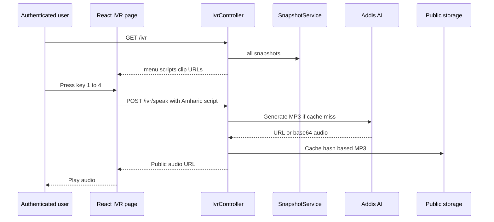

# IVR and WFP Integration

This document covers the two major additions after the original AgriVoice dashboard/cooperative implementation:

1. An authenticated browser simulation of an Amharic keypad IVR backed by Addis AI text-to-speech.
2. An optional, idempotent import of historical WFP Ethiopia wholesale prices.

Related documents: [Documentation.md](Documentation.md) · [Architecture.md](Architecture.md) · [Domain-and-Database.md](Domain-and-Database.md) · [Security-and-Authentication.md](Security-and-Authentication.md)

---

## 1. Amharic IVR simulator

### Purpose and current boundary

The IVR is a **browser keypad simulator**, not a deployed telephone/USSD service. It lets an authenticated Fortify user press keys `1`–`4` to hear current crop prices in Amharic and key `5` to replay the fixed menu.

| Capability | Status |
| ---------- | ------ |
| Browser keypad and physical keyboard keys | Implemented |
| Live snapshot scripts for teff/coffee/maize/wheat | Implemented |
| Amharic number-to-words | Implemented |
| Addis AI text-to-speech | Implemented when API key exists |
| Fixed clip generation/cache | Implemented |
| Telephone carrier / SIP / USSD integration | Not implemented |
| Browser microphone recording | Not wired to routes/UI |
| Addis STT and agriculture chat methods | Service methods exist, but no controller route/UI uses them |
| Key 5 conversational assistant | Not implemented; key 5 replays menu |

### Routes and authorization

Defined in `routes/web.php` inside `Route::middleware(['auth', 'verified'])`:

| Method | Path | Name | Handler |
| ------ | ---- | ---- | ------- |
| GET | `/ivr` | `ivr.index` | `IvrController@index` |
| POST | `/ivr/speak` | `ivr.speak` | `IvrController@speak` |

The same verification caveat applies as elsewhere: `User` does not currently implement `MustVerifyEmail`, so `verified` is not a strong gate.

### Source map

| Path | Responsibility |
| ---- | -------------- |
| `app/Http/Controllers/IvrController.php` | Builds page props; TTS JSON endpoint |
| `app/Http/Requests/IvrSpeakRequest.php` | Validates speech text |
| `app/Services/IvrScriptBuilder.php` | Menu crops, Amharic labels, price scripts, unused assistant system prompt |
| `app/Services/AmharicNumberSpeech.php` | Integer → Amharic words; object form for “press N” |
| `app/Services/IvrAudioCatalog.php` | Fixed clip definitions, paths, startup queue, versioned URLs |
| `app/Services/AddisAiVoiceService.php` | Addis TTS, estimate, audio download/cache; STT/chat methods |
| `app/Console/Commands/GenerateIvrAudioCommand.php` | Pre-generate fixed menu clips |
| `resources/js/pages/ivr.tsx` | Audio queue, TTS fetch, keypad behavior |
| `resources/js/components/ivr-keypad.tsx` | Key buttons and physical keyboard listener |
| `tests/Feature/IvrTest.php` | Route/auth/TTS cache/command tests |
| `tests/Unit/AmharicNumberSpeechTest.php` | Number-word tests |

### Page payload

`IvrController@index` computes snapshots through the same `SnapshotService::all()` as the public dashboard, filters to four menu crops, and returns:

| Prop | Shape / meaning |
| ---- | --------------- |
| `menuOptions` | Keys `1`–`4` mapped to crops; key `5` has null crop and label “repeat” |
| `cropScripts` | Amharic live-price sentence per crop |
| `clipUrls` | Existing public fixed clip URLs keyed by clip id |
| `startupQueue` | Existing fixed clip URLs in welcome→prompt1…prompt5 order |
| `addisConfigured` | Whether `ADDIS_AI_API_KEY` is non-empty |

### Key mapping

| Key | Crop / action |
| --- | ------------- |
| `1` | Teff (`ጤፍ`) |
| `2` | Coffee (`ቡና`) |
| `3` | Maize (`በቆሎ`) |
| `4` | Wheat (`ስንዴ`) |
| `5` | Replay fixed startup queue |

### Runtime flow



### Script construction

For each market snapshot:

- No reports or non-positive price → “data is being collected.”
- Otherwise:
  - market slug → Amharic market name;
  - rounded price → Amharic words;
  - confidence → Amharic words;
  - sentence announces ETB per quintal and confidence percent.

`AmharicNumberSpeech` handles negative values, 0–19, tens, hundreds, thousands, and millions recursively. `pressForm()` supplies Amharic object forms such as `አንድን`.

### Addis AI integration

Configuration (`config/services.php`, `.env.example`):

```dotenv
ADDIS_AI_API_KEY=
ADDIS_AI_VOICE_ID=am-hamen
```

API base: `https://api.addisassistant.com`.

| Method | Endpoint | Used by current UI? |
| ------ | -------- | ------------------- |
| `speak()` / `generateClip()` | `/api/v1/voice/generations` | Yes |
| `estimate()` | `/api/v1/voice/estimate` | CLI command |
| `transcribe()` | `/api/v2/stt` | No route/UI |
| `chat()` | `/api/v1/chat_generate` | No route/UI |

TTS caching:

- Disk: Laravel `public`.
- Dynamic path: `ivr/cache/{sha256(voice|text)}.mp3`.
- Fixed path: `ivr/{clipId}.mp3`.
- Ensure `php artisan storage:link` so `/storage/ivr/*` resolves.

Generate fixed clips:

```bash
php artisan ivr:generate-audio
php artisan ivr:generate-audio --yes
php artisan ivr:generate-audio --force --yes
```

The command estimates cost first, prompts unless `--yes`, uses deterministic request ids, skips existing clips unless `--force`, and stops on the first generation failure.

### Frontend behavior and caveats

- Automatically attempts startup audio once after mount. Browser autoplay policy may reject playback; the page catches and stops without a visible error.
- While audio plays, keys `1`–`4` are disabled; key `5` remains enabled and restarts the menu.
- `speakText()` returns silently if Addis is not configured; the keypad still renders.
- API errors are parsed but not surfaced as visible messages.
- `clipUrls` is returned by the controller but the page type currently declares only `startupQueue`; the page does not consume the full map directly.
- `listening` styling exists on `IvrKeypad` but current page never activates it.
- The app sidebar exposes an “IVR demo” link even for guests; the route still redirects unauthenticated users to login. The public landing does not deep-link to `/ivr`.

---

## 2. WFP Ethiopia historical price import

### Purpose

`WfpFoodPricesSeeder` imports selected WFP VAM Ethiopia rows into the existing `reports` table as verified official reports. The committed CSV makes import reproducible and independent of a developer Downloads folder.

It is **optional** and intentionally not called by `DatabaseSeeder` because the source is large and historical.

### Files

| Path | Responsibility |
| ---- | -------------- |
| `database/data/wfp_food_prices_eth.csv` | Committed source dataset |
| `database/seeders/WfpFoodPricesSeeder.php` | Lazy parse/filter/map/chunk insert |
| `tests/fixtures/wfp_food_prices_eth_sample.csv` | Small test fixture |
| `tests/Feature/WfpFoodPricesSeederTest.php` | Mapping, filtering, unit conversion, idempotency |

### Run command

```bash
php artisan db:seed --class=WfpFoodPricesSeeder
```

The seeder calls `MarketSeeder` first. It deletes existing reports with `source = wfp_food_prices`, then re-imports; reruns replace rather than duplicate WFP history. The delete-then-insert sequence is **not wrapped in a transaction**, so a parse/database failure mid-run can leave deleted or partially imported WFP history.

### Accepted source rows

A row is imported only when all conditions pass:

| Field | Required value |
| ----- | -------------- |
| `market` | Addis Ababa, Jimma, or Nazareth |
| `commodity` | Explicit mapping to one of seven Crop cases |
| `currency` | `ETB` |
| `pricetype` | `Wholesale` |
| `unit` | `100 KG` or `KG` |
| `priceflag` | Contains `actual` |
| `price` | Numeric and > 0 after conversion |

Market mapping:

- Addis Ababa → `addis_ababa`
- Jimma → `jimma`
- Nazareth (historical name) → `adama`

Commodity mapping includes teff variants, maize, wheat, sorghum, coffee, sesame, and beans/lentils/chickpeas/soybeans → `pulses`. Processed flour and unsupported food-aid variants are omitted.

At audit baseline, the committed CSV yields about **2,371** accepted rows after filtering, dated roughly **2000-01-15 through 2021-10-15**. Accepted rows concentrate in sorghum, wheat, maize, teff, and pulses; coffee and sesame mappings exist in code but have no accepted rows in the committed file. Nearly all accepted production-CSV rows are already `100 KG` (the `KG × 100` path is covered by the test fixture).

### Unit conversion

- `100 KG` → unchanged (one quintal).
- `KG` → multiplied by 100.

### Inserted report contract

| Column | Value |
| ------ | ----- |
| `crop` | Mapped `Crop` value |
| `market_id` | Mapped market |
| `price` | ETB / quintal, 2 decimals |
| `reporter_type` | `official` |
| `source` | `wfp_food_prices` |
| `agent_id` | null |
| `cooperative_member_id` | null |
| `reported_at` | Source date at start of day |
| `is_flagged` | false |
| `status` | `verified` |

Rows are streamed through `LazyCollection` and inserted in chunks of 500. This bounds CSV read memory, although a malformed `array_combine` row shape could still need defensive handling in future.

### How imported history affects the application

- Public report feed: rows can appear only if among newest 50; historical rows normally will not.
- Snapshot dashboard: only records in trailing 14 days contribute. Old WFP history will not change current tiles.
- Trend heuristic: same 14-day boundary through snapshot collection.
- Regional cooperative benchmark: trailing seven days only.
- Historical dataset is currently stored in `reports`; there is no separate historical analytics page.

### Data caveats

- WFP prices are external historical data, not live prices.
- Import is mapping-based; unsupported markets/commodities are silently skipped.
- Multiple source commodity variants may map to one crop (for example several bean types → pulses), so downstream aggregation treats them as one category.
- Official reporter weight (1.5) applies only if a WFP row falls inside a current snapshot window.

---

## 3. Tests and verification

```bash
php artisan test --compact tests/Feature/IvrTest.php
php artisan test --compact tests/Unit/AmharicNumberSpeechTest.php
php artisan test --compact tests/Feature/WfpFoodPricesSeederTest.php
```

Tests fake Addis HTTP and public storage; no paid/external request should be made by the suite.
